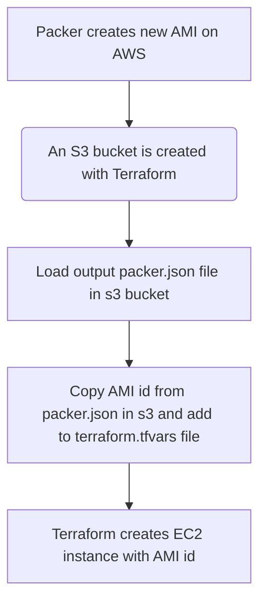

# Packer + Terraform + CI/CD PoC

This repository is a Proof of Concept in which we will use three tools mentioned below to automate the creation of an EC2 instance in AWS from a customised AMI so that when the EC2 instance is started, a Grafana service and a Prometheus service are created from docker. 

- [Tools used](#tools-used)
- [Installation](#installation)
- [Workflow](#workflow)
- [Poc Overview](#poc-overview)
- [Usage](#usage)
- [Important](#important)

## Tools used 

- [Packer](https://www.packer.io/) is one of the open-source tools developed by HashiCorp. Packer is a tool for creating machine images in this case an  Amazon Machine Image from a single source configuration. It allows you to define machine image templates as code with a default configuration to be used when a machine with that AMI is lifted.
- [Terraform](https://www.terraform.io/) is an open-source infrastructure as code (IaC) tool developed by HashiCorp. It is designed to help automate and manage the provisioning and configuration of infrastructure resources across various cloud providers in this case use Amazon Web Service as a Cloud Provider. Terraform allows you to define your infrastructure using declarative configuration files, and then it handles the process of creating, updating, and deleting resources to match the desired state defined in those files.
- [Github actions](https://docs.github.com/en/actions) is an automation and continuous integration/continuous deployment (CI/CD) platform provided by GitHub. It allows developers to automate various tasks, workflows, and processes directly within their GitHub repositories. With GitHub Actions, you can build, test, and deploy your code, as well as perform other custom automation tasks, all in response to events and triggers like code pushes, pull requests, and more.
- [Amazon Web Service (AWS)](https://aws.amazon.com/) is a comprehensive and widely used cloud computing platform provided by Amazon.com. It offers a broad set of cloud-based services, including virtual machine (EC2), storage (s3 bucket),networking, security, and more. AWS allows organizations to access and utilize these services over the internet, providing scalable, flexible, and cost-effective solutions for a wide range of IT needs.

## Installation

In macOs the best way is to use [Brew](https://brew.sh/), so you should have Brew installed in your machine, in the first place.

The packages to be used are now installed with a series of commands. First, install the HashiCorp tap, a repository of all our Homebrew packages.

``` bash
brew tap hashicorp/tap
```

Now, install Packer with the following command:

``` bash
brew install hashicorp/tap/packer
```

Now, install Terraform with the following command:

``` bash
brew install hashicorp/tap/terraform
```

Finally, the AWS CLI package is installed in case you want to run something locally and not via Github actions.
  
  ``` bash
  curl "https://awscli.amazonaws.com/AWSCLIV2.pkg" -o "AWSCLIV2.pkg"
  sudo installer -pkg AWSCLIV2.pkg -target /
  ```

## Workflow

The workflow of this PoC is as follows:





## PoC Overview

As I mentioned in the introduction, this is a proof of concept in which three main tools are used: Packer, Terraform and Github Actions, and Amazon Web Service (AWS) has been used as Cloud. 

First of all, all the steps mentioned below in the workflow are performed through Github actions and bash script to raise and drop EC2 instances, s3 buckets and create and delete AMIs. Nothing is executed manually! 

First you have to decide on which Amazon Machine Image you want to build with Packer. To do this you need to log into AWS and choose an AMI, in this case an *ubuntu focal 20.04* has been chosen.

After selecting the AMI, Packer will build a custom AMI by provisioning it from a script in which this new AMI is configured so that when it is deployed to an EC2 instance it will have the expected configuration. The script has been done in bash and consists of installing and updating packages to build two Docker services which will be Grafana and Prometheus.Packer copies this file into the machine right into the path where every time a new machine is started with that AMI it will run that script. You can see it in this sample piece of code from my Packer file: 

``` bash
  provisioner "shell" {
    inline = [
      "sudo cp /home/ec2-user/packer-config.sh /var/lib/cloud/scripts/per-boot/packer-config.sh",
      "sudo chmod +x /var/lib/cloud/scripts/per-boot/packer-config.sh",
      "rm /home/ec2-user/packer-config.sh",
    ]
  }
```

If you want to check the complete configuration of the packer file you can find it here: 

```bash
packer/aws_packer_ami.pkr.hcl
```

If you want to review the complete configuration of the provisioning file that Packer uses, you can view it here: 

```bash
packer/packer-config.sh
```
As you can see in the file above, the provisioning of the Amazon Image consists of raising two docker services, a [Grafana](https://grafana.com/) and a [Prometheus](https://prometheus.io/). These are monitoring services, in this case the installation is simple but you can add any configuration you want. 

Once the AMI is created, Packer stores the ID of the new AMI in a json file that is stored in a S3 bucket. This file is used by Terraform to create the EC2 instance with the new AMIv from a script that you can find in the following path: 

```bash
scripts/packer-terraform.sh
```

In addition to creating an EC2 instance, other resources needed to access the EC2 instance, such as networks and ports, are created. In addition, as two services run within the instance and are exposed on certain ports, a security group must be created to enable these ports. Below is an example of a security group where the ssh, grafana and prometheus ports are enabled in addition to the http port. 

```bash 
resource "aws_security_group" "sg_ec2" {
  name        = "allow_ssh_http_grafana"
  description = "Allow ssh http inbound traffic"

  ingress {
    description      = "SSH from VPC"
    from_port        = 22
    to_port          = 22
    protocol         = "tcp"
    cidr_blocks      = ["0.0.0.0/0"]
    ipv6_cidr_blocks = ["::/0"]
  }

  ingress {
    description      = "HTTP from VPC"
    from_port        = 8080
    to_port          = 8080
    protocol         = "tcp"
    cidr_blocks      = ["0.0.0.0/0"]
    ipv6_cidr_blocks = ["::/0"]
  }

    ingress {
    description      = "grafana port"
    from_port        = 3000
    to_port          = 3000
    protocol         = "tcp"
    cidr_blocks      = ["0.0.0.0/0"]
    ipv6_cidr_blocks = ["::/0"]
  }

      ingress {
    description      = "prometheus port"
    from_port        = 9090
    to_port          = 9090
    protocol         = "tcp"
    cidr_blocks      = ["0.0.0.0/0"]
    ipv6_cidr_blocks = ["::/0"]
  }

  egress {
    from_port        = 0
    to_port          = 0
    protocol         = "-1"
    cidr_blocks      = ["0.0.0.0/0"]
    ipv6_cidr_blocks = ["::/0"]
  }

  tags = {
    Name = "ec2 security group"
  }
}
```

As you can see this script has two things of uses, the use case *all*, with which you perform the upload to the s3 bucket and get the new id of the AMI. On the other hand there is the *destroy* use case, which takes care of cleaning up both the newly created AMI and its snapshot in case the infrastructure is destroyed, but we'll talk about that later. 

In case you want to run this script for any of the two cases manually for local testing you have to add to the run command the case you want to use, below you can see an example: 

```bash
./scripts/packer-terraform.sh all
```

## Usage

It is true that this proof of concept can be run manually, but this is not the purpose of it. The purpose of this PoC is to use Packer with Github actions. Therefore, the following will explain how to run it correctly.

As can be seen in the following image, two workflows have been created. One to build the AMI and deploy with it a new EC2 instance which has two services (Grafana and Prometheus) provisioned when the instance is started. The second workflow is used to remove all the AWS infrastructure created with the first workflow, both the AMI, its snapshot, the EC2 instance and the network and port configuration used.  


Both workflows have a workflow dispatch event trigger. This is triggered on the branch you want to execute. It is possible to modify the workflows so that they are triggered when you push to master, but in this case it is preferable that this step is done manually so as not to raise different infrastructures at the same time and lose control of their state. 


Once it is clear how this infrastructure would be deployed or removed from workflows, it must be clear whether these workflows need to receive any environment variables or secrets. In this case the following should be taken into account:

- Environment variables: In order to execute the files related to Packer and Terraform and other scripts, environment variables have been created in the workflows to indicate where these files are located. Here is an example:

  ```bash
  jobs:
    packer_terraform:
      name: 'packer_terraform'
      runs-on: ubuntu-latest
      env:
        TF_WORKING_DIR: './scripts'
        TF_TERRAFORM_DIR: './terraform-deploy'
        TF_TERRAFORM_BUCKET_DIR: './terraform-bucket'
  ```

- Secrets: In order to access AWS, the workflows need to have access to the AWS_ACCESS_KEY_ID and AWS_SECRET_ACCESS_KEY. These are stored in Github secrets and are used in the workflows as follows:

  ```bash
  env:
  AWS_ACCESS_KEY_ID: ${{ secrets.AWS_ACCESS_KEY_ID }}
  AWS_SECRET_ACCESS_KEY: ${{ secrets.AWS_SECRET_ACCESS_KEY }}
  ARGS: "-av"
  ```

  


Now it can be deployed thanks to all the tools used! GO FORWARD!

## Important

Try not to deploy different infrastructures before removing the previous one, the terraform state might forget to remove certain resources that can cost you extra on AWS.


