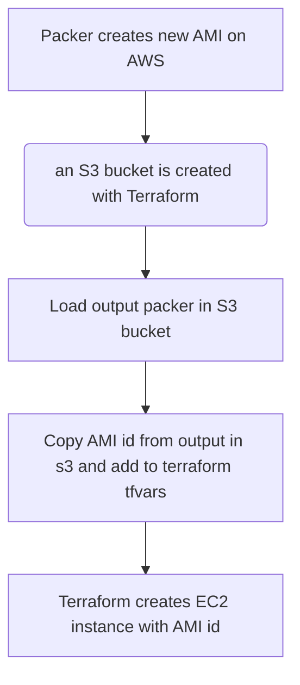

# Packer + Terraform + CI/CD PoC

This repository is a Proof of Concept in which we will use three tools mentioned below to automate the creation of an EC2 instance in AWS from a customised AMI so that when the EC2 instance is started, a graphana service and a prometheus service are created from docker. 

- [Tools used](#tools-used)
- [Poc Overview and Usage](#poc-overview-and-usage)
- [Workflow](#workflow)

## Tools used 

- [Packer](https://www.packer.io/) is one of the open-source tools developed by HashiCorp. Packer is a tool for creating machine images in this case an  Amazon Machine Image from a single source configuration. It allows you to define machine image templates as code with a default configuration to be used when a machine with that AMI is lifted.
- [Terraform](https://www.terraform.io/) is an open-source infrastructure as code (IaC) tool developed by HashiCorp. It is designed to help automate and manage the provisioning and configuration of infrastructure resources across various cloud providers in this case use Amazon Web Service as a Cloud Provider. Terraform allows you to define your infrastructure using declarative configuration files, and then it handles the process of creating, updating, and deleting resources to match the desired state defined in those files.
- [Github actions](https://docs.github.com/en/actions) is an automation and continuous integration/continuous deployment (CI/CD) platform provided by GitHub. It allows developers to automate various tasks, workflows, and processes directly within their GitHub repositories. With GitHub Actions, you can build, test, and deploy your code, as well as perform other custom automation tasks, all in response to events and triggers like code pushes, pull requests, and more.
- [Amazon Web Service (AWS)](https://aws.amazon.com/) is a comprehensive and widely used cloud computing platform provided by Amazon.com. It offers a broad set of cloud-based services, including virtual machine (EC2), storage (s3 bucket),networking, security, and more. AWS allows organizations to access and utilize these services over the internet, providing scalable, flexible, and cost-effective solutions for a wide range of IT needs.

## Workflow

The workflow of this PoC is as follows:





## PoC Overview and Usage 

As I mentioned in the introduction, this is a proof of concept in which three main tools are used: Packer, Terraform and Github Actions, and Amazon Web Service (AWS) has been used as Cloud.

First of all, all the steps mentioned below are performed through Github actions, nothing is executed manually! 

First you have to decide on which Amazon Machine Image you want to build with Packer. To do this you need to log into AWS and choose an AMI, in this case an *ubuntu focal 20.04* has been chosen.

After selecting the AMI, Packer will build a custom AMI by provisioning it from a script in which this new AMI is configured so that when it is deployed to an EC2 instance it will have the expected configuration. The script has been done in bash and consists of installing and updating packages to build two Docker services which will be Grafana and Prometheus.Packer copies this file into the machine right into the path where every time a new machine is started with that AMI it will run that script. You can see it in this sample piece of code from my Packer file: 

``` bash
  provisioner "shell" {
    inline = [
      "sudo cp /home/ec2-user/packer-config.sh /var/lib/cloud/scripts/per-boot/packer-config.sh",
      "sudo chmod +x /var/lib/cloud/scripts/per-boot/packer-config.sh",
      "rm /home/ec2-user/packer-config.sh",
    ]
  }
```

If you want to check the complete configuration of the packer file you can find it here: 

```bash
packer/aws_packer_ami.pkr.hcl
```

If you want to review the complete configuration of the provisioning file that Packer uses, you can view it here: 

```bash
packer/packer-config.sh
```


